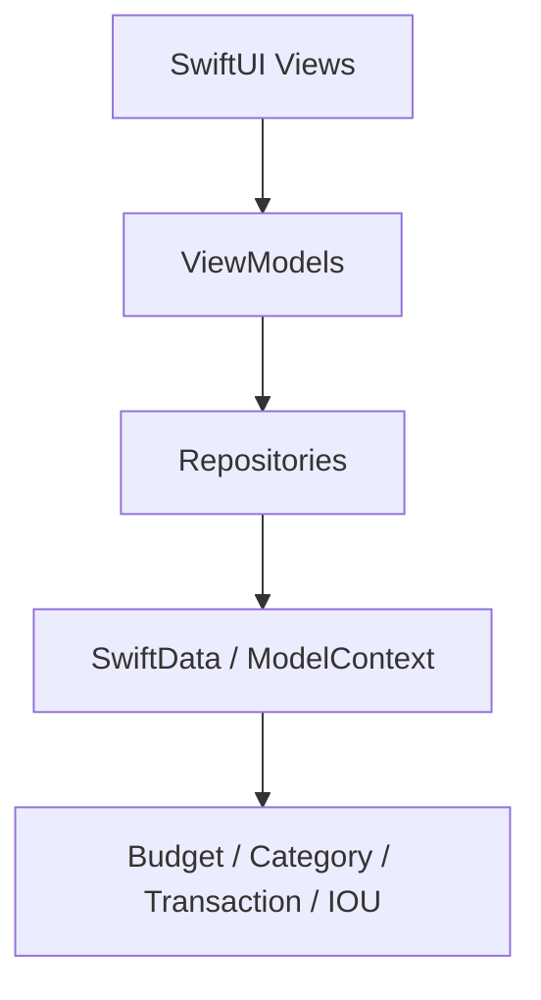

# No-Look-Budget 実装計画 (Master Plan v1.0)

## 1. 目指すゴールと提供価値 (マーケティング連動)
本アプリのターゲットは「浪費家・ADHD傾向で継続が苦手なユーザー」です。
既存の家計簿アプリが陥りがちな「入力の面倒さ」「立替による完璧主義の崩壊」を防ぐため、以下の3つの価値（MVPコア）を最優先で実現します。

1. **強制視界占有 (No-Look Experience)**: ウィジェットによる残高・色（警告）のダイナミック表示。
2. **極限の1タップ入力**: アプリを開かず、ウィジェットから直接金額だけを入れる体験。
3. **立替セパレーター**: 立替分をスワイプ等で別枠に逃し、自己予算を綺麗に保つ仕組み。

現在、**これらの要素を盛り込んだSwiftUIによるUI/UXモックの実装は完了**しています。
今後は取得した専門スキル（アーキテクチャ、UI/UX、テスト駆動、QA自動化）をフル活用し、堅牢なデータ連動（SwiftData）フェーズへ移行します。

---

## 2. User Review Required (要確認事項)

> [!CAUTION]
> **Apple Wallet (Apple Pay) 連携の実現要件について**
> マーケティング戦略上の［Must Have］として挙げられている「Apple Wallet決済時の自動即時反映」は、サードパーティ（一般開発者）向けとしてはセキュリティ上の制約からAPI（PassKit/FinanceKit等）が開放されていないか、著しく制限されている可能性が高いです。
> この点は**最優先の技術検証（PoC）**タスクとし、不可だった場合は「Apple Shortcuts（ショートカットアプリ）を用いた自動化」へのピボットを直ちに検討します。

---

## 3. アプリケーション・アーキテクチャ設計
`architecture-patterns` スキルに則り、SwiftUIとSwiftDataを強結合させず、メンテナンス性の高い設計を採用します。

### 採用パターン: MVVM + Repository Pattern

* **View**: UIの描画とユーザー入力の受け付けのみ（View内に`@Query`を直接書くことは極力避ける）。
* **ViewModel**: 画面ごとの状態管理とビジネスロジック（借金計算や立替フラグの処理）を担当。
* **Repository**: SwiftDataのCRUD処理を隠蔽するプロトコルベースのデータアクセス層（これによりテスト時のモック差し替えが容易になる）。

---

## 4. 開発フェーズと実装マイルストーン

### Phase 1: 基礎データ層の構築 (TDDベース)
`test-driven-development` のスキルに基づき、まずはロジック単体のテスト（Unit Test）を先行させます。
* **[NEW] `Models/`**: `Budget`, `ItemCategory`, `Transaction`, `IOUManager` のスキーマ定義。
* **[NEW] `Repositories/`**: 支出の保存（Create）、残高の集計（Read）を行うRepositoryの実装とテスト。
* **[NEW] 月跨ぎ・借金繰越ロジック**: `BudgetCalculator`（仮）を作成し、「前月のマイナス分」を次期予算から自動減額するロジックをテスト駆動で実装。

### Phase 2: コアUIへのデータ統合 (MVVM化)
モック（ダミーデータ）で動いているViewにViewModelを接続します。
* **[MODIFY] `QuickInputModalView.swift`**: ViewModel経由での実際のトランザクション登録。
* **[MODIFY] `DashboardView.swift` / `CategoryDetailView.swift`**: DBの現在残高に基づいたゲージのアニメーションと色の動的変化（`ui-ux-pro-max`適用）。
* **[MODIFY] `TransactionHistoryView.swift`**: 登録済みデータの編集・削除（Undoの代替）ロジックの結合。

### Phase 3: 月末の最重要イベント (Review & Adjusting)
* **[MODIFY] `MonthlyReviewView.swift`**: 月末の決算処理（黒字/赤字の確定）と、借金が発生した場合の「翌月予算からの減額（または分割回収）」をデータベースに確定させる処理。

### Phase 4: ウィジェット（No-Look Experience）の実装
* **[NEW] `NoLookBudgetWidget`**: AppIntentを利用し、最新のSwiftData残高を反映させたダイナミックウィジェット。
* **[NEW] ウィジェットからのディープリンク・直接入力**: ウィジェットのボタンから `QuickInputModalView` を直接指定カテゴリで開く導線。

---

## 5. 品質保証 (QA) とデバッグ戦略

`qa-test-planner` および `systematic-debugging` スキルに則り、以下のテスト戦略を敷きます。

### Automated Tests (自動テスト)
1. **ユニットテスト (Unit Tests)**
   * SwiftDataのインメモリコンテキストを利用し、`Repository` のCRUD動作を検証。
   * 立替プール（別枠）と通常予算の計算が混ざらないかの境界値テスト。
2. **UIテスト (XCUITest)**
   * 1タップ入力フロー（ウィジェットタップ → 金額入力 → 保存）が最短ストロークで完了し、エラー画面に遷移しないことの担保。

### Manual Verification (手動 / Vibe Check)
* UI/UXの「触り心地（Vibe）」は、実装するたびに必ず実機（またはシミュレータ）で確認します。
* スワイプ操作による立替セパレートの手触り感（アニメーションの滑らかさ）を `swiftui-ui-patterns` に則り微調整します。

---

## 6. コンプライアンス・リリース要件
各種ガイドラインやライセンスを遵守するための設定（構築済のMarkdown管理）。
* `docs/compliance/app_store_guidelines.md` (審査対策)
* `docs/compliance/oss_licenses.md` (OSS管理)
