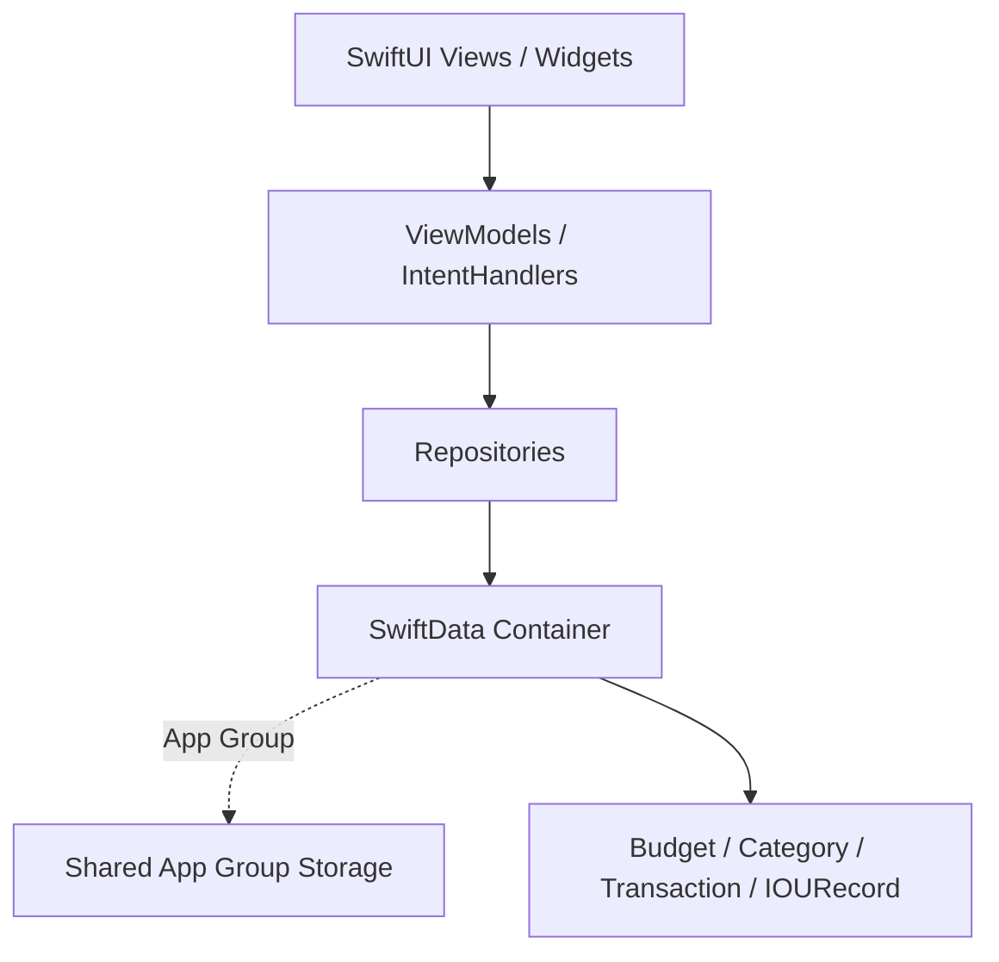

# No-Look-Budget 実装計画 (Master Plan v2.0)

## 1. 目指すゴールと提供価値 (マーケティング連動)
本アプリのターゲットは「浪費家・ADHD傾向で継続が苦手なユーザー」です。
既存の家計簿アプリが陥りがちな「入力の面倒さ」「立替による完璧主義の崩壊」を防ぐため、以下の3つの価値（MVPコア）を最優先で実現します。

1. **強制視界占有 (No-Look Experience)**: ウィジェットによる残高・色（警告）のダイナミック表示。
2. **極限の1タップ入力**: アプリを開かず、ウィジェットから直接金額だけを入れる体験。
3. **立替セパレーター**: 立替分をスワイプ等で別枠に逃し、自己予算を綺麗に保つ仕組み。

現在、**これらの要素を盛り込んだSwiftUIによるUI/UXモックの実装は完了**しています。
今後は堅牢なアーキテクチャ設計、App Groupを利用したウィジェット連携、そしてテスト駆動開発（TDD）による実データ連動フェーズへ移行します。

---

## 2. 既知の制約とスコープ外事項 (Risk & Out of Scope)

> [!WARNING]
> **Apple Wallet (Apple Pay) 連携のスコープ外化**
> マーケティング戦略上で理想としていた「Apple Wallet決済時の自動即時反映」は、サードパーティ向けに開放されたAPIが存在しないため、**MVPの技術的スコープから除外（Alternativeへ移行）** します。
> 当面は「ウィジェットからの超高速手動入力」を唯一のデータソースとして磨き込みます。将来的な自動化はiOSの進化待ち、または「Apple Shortcuts（ショートカットアプリ）」を用いたハック的アプローチでのみ検証します。

---

## 3. アプリケーション・アーキテクチャ設計

### 3.1. 採用パターン: MVVM + Repository Pattern

* **View**: UIの描画とユーザー入力の受け付けのみ（View内に`@Query`を直接書くことは避ける）。
* **ViewModel**: 画面ごとの状態管理とビジネスロジックを担当。
* **Repository**: プロトコル（例: `BudgetRepositoryProtocol`）として定義し、CRUD処理をカプセル化。テスト時はモック（`MockBudgetRepository`）に差し替える。

### 3.2. データ共有と異常系ハンドリング
* **App Group**: メインアプリとウィジェット（App Extension）間でSwiftDataのContainer（SQLite）を共有するため、`App Group`（例: `group.com.arima0903.NoLookBudget`）を設定し、保存領域を共通化します。
* **エラーハンドリング**:
    * SwiftData保存失敗時は `do-catch` で捕捉し、ユーザーフレンドリーなエラーアラートを表示。
    * 意図しない月跨ぎ処理のクラッシュを防ぐため、バッチ実行前には現状の残高状態を一時キャッシュし、失敗時にロールバックできるリカバリ処理を含めます。

---

## 4. 開発フェーズとスケジュール（マイルストーン）

各フェーズはアジャイル的に進行し、完了条件（Definition of Done）を満たすことで次へ進みます。
※スケジュール（Dayは相対的な作業日数）

### Phase 0: 環境構築とスキーマ定義 (Day 1)
コーディング着手前の必須設定を行います。
* **[タスク]**:
  * XcodeのTarget設定にて `App Group` を追加し、共有ディレクトリを有効化。
  * `Models/` 以下のスキーマ定義（`Budget`, `ItemCategory`, `Transaction`, `IOURecord`）の確定と、`@Model` マクロへの依存確認。
  * Repositoryプロトコル（`TransactionRepositoryProtocol` 等）のシグネチャ定義。
* **[完了条件 (DoD)]**:
  * App Groupが有効な状態でアプリがビルドできること。
  * データモデルのエンティティ関係（ER図相当）がコード上で定義されていること。

### Phase 1: 基礎データ層の構築とTDD (Day 2-3)
ワークスペースに導入した `test-driven-development` の考え方に則り、Unit Testを先行実装します。
* **[タスク]**:
  * モックリポジトリとインメモリSwiftDataコンテナの構築。
  * **実装する具体的なテストケース**:
    1. `test_addTransaction_reducesBudgetBalance` (支出追加で予算残高が減るか)
    2. `test_iouTransaction_doesNotAffectMainBudget` (立替出費がメイン予算に影響しないか)
    3. `test_carryOverDebt_deductsFromNextMonthBudget` (月跨ぎ時に前月のマイナス分が次月予算から引かれるか)
* **[完了条件 (DoD)]**:
  * `Tests/` ディレクトリ配下にXCTestのファイルが整備され、上記のコアロジックテストが全て `Passed`（グリーン）になること。

### Phase 2: ウィジェットの早期結合検証 (Day 4)
本アプリのコアバリューである「ウィジェット体験」を技術的に一番重いリスクとして捉え、早期にプロトタイプ化します。
* **[タスク]**:
  * Phase 1で構築したSwiftDataコンテナ（App Group共有）を読み込む `NoLookBudgetWidget` のバックエンド連携。
  * iOS 18+ の `AppIntent` を用いた「ウィジェットボタンからの支出登録」の疎通確認。
* **[完了条件 (DoD)]**:
  * アプリ側で登録した出費がウィジェットの残高に反映されること。
  * ウィジェット側のボタン操作で、アプリを開かずにDBのデータが更新されること。

### Phase 3: コアUIのMVVM化とCRUD結合 (Day 5-6)
既存のモックViewをViewModel経由で実際のデータベースに接続します。
* **[タスク]**:
  * `QuickInputModalView.swift`: ViewModel経由での即時トランザクション登録（手動入力）。
  * `DashboardView.swift` / `CategoryDetailView.swift`: DBの監視とUIの自動更新（ゲージ色変容）。
  * `TransactionHistoryView.swift`: 登録済みデータの修正・削除の実装。
* **[完了条件 (DoD)]**:
  * シミュレータ上で、ホーム画面〜入力〜履歴編集の一連のUI操作が実データを伴って破データを伴って破綻なく動作すること。

### Phase 4: 月末イベント処理の実装 (Day 7)
* **[タスク]**:
  * `MonthlyReviewView.swift`: 月替わり処理。前月の集計と「借金繰越（またはIOUプールへの移動）」をDBトランザクションとして安全に実行するロジック。
* **[完了条件 (DoD)]**:
  * 端末の時刻を翌月に進めた際、適切に「予算リセット」と「借金マイナス」が適用された状態のダッシュボードが表示されること。

---

## 5. 品質保証 (QA) とデザイン洗練

導入済みのスキルを基に品質を高めます。

1. **自動テストの継続**:
   * 機能追加のたびにPhase 1で定義したXCTestを実行し、リグレッションを防ぎます。
2. **UI/UXのブラッシュアップ**:
   * CRUD結合が安定した後、スワイプ操作の手触りやゲージのアニメーションを最適化します。
3. **エラーハンドリング検証**:
   * ウィジェットからの連続タップ等、意図しない異常操作時のレースコンディションが発生しないか境界値テストを手動で実施します。

---

## 6. コンプライアンス・リリース要件
各種ガイドラインやライセンスを遵守するための設定（構築済のMarkdown管理）。
* `docs/compliance/app_store_guidelines.md` (審査対策・WidgetKitの更新頻度制限等についてのチェック事項)
* `docs/compliance/oss_licenses.md` (OSSパッケージの記録)
