# No-Look-Budget: Service Flow

「開かせない」UXと「立替」分離のコアフローを定義します。

```mermaid
sequenceDiagram
    actor User as ユーザー (ADHD気質/浪費家)
    participant LockScreen as iPhone (ウィジェット)
    participant Wallet as Apple Wallet (Apple Pay)
    participant iOSApp as アプリ本体 (No-Look-Budget)
    participant LogicDB as ローカル処理・DB (SwiftData / CoreData)

    %% Flow 1: 日常の「残弾」確認 (No-Look)
    rect rgb(30, 40, 30)
    Note over User,LockScreen: 1. No-Lookで残高を把握 (強制視界占有)
    User->>LockScreen: スマホを見る (通知や時計の確認等)
    alt 残高が潤沢な場合
        LockScreen-->>User: 🟢 グリーンの大きな円・数字 (安心)
    else 残高が危険水域の場合
        LockScreen-->>User: 🔴 レッドの巨大な警告表示 (危機感の強制認識)
    end
    end

    %% Flow 2: Apple Wallet 連携による全自動入力 (究極の摩擦ゼロ)
    rect rgb(30, 30, 40)
    Note over User,LogicDB: 2. 日常の買い物 (Apple Pay決済時)
    User->>Wallet: コンビニ等でQUICPay/iD/クレカ等で決済
    Wallet-->>iOSApp: 決済完了の通知 (※技術的実現要件に依存)
    iOSApp->>LogicDB: 自動で支出として記録、全体予算から減算
    LogicDB->>LockScreen: ウィジェット表示を即時更新 (WidgetKit)
    end

    %% Flow 3: 立替金発生時のローフリクション処理 (手動入力・分離)
    rect rgb(40, 30, 30)
    Note over User,LogicDB: 3. 飲み会等の立替分離フロー (手入力時)
    User->>LockScreen: ウィジェットをタップ
    LockScreen->>iOSApp: 1タップ入力モーダルを直接起動
    User->>iOSApp: 金額入力 ＋ 「💳 自分の支出 / 🍻 立替(Front)」のトグル選択
    
    alt 自分の支出
        iOSApp->>LogicDB: Budgetの「残高」から直接減らす
    else 立替(回収待ち)
        iOSApp->>LogicDB: 「Nomikai(立替)」枠に借金としてプールする。メインの残高は減らさない。
    end
    
    LogicDB->>LockScreen: ウィジェットの表示を同期・更新
    end
```

## サービスフローのポイント（ビジネス戦略視点）
競合となるマネーフォワードやZaimなどの「家計簿アプリ」は、入力ステップが多く、カテゴリ分類が必要なためADHDの方には「面倒臭い」というハードルになりがちです。

本サービスは以下の3点を強み（勝機）とします：
1. **強制視界占有**: 「今月あといくら使えるか？」を色の劇的な変化で直感的に訴える。
2. **全自動入力への挑戦**: 入力という最大のハードルを下げるため、Apple Walletと連動した自動記録システムを（将来的に）実装する。
3. **完璧主義崩壊の防止（立替セパレーター）**: 飲み会の立替などによって自分の家計簿が「赤字ノイズ」で汚れるのを防ぐため、入力時に「自分の出費か、立替か」をトグルで瞬時に切り分け、立替分は別枠へ逃す。
