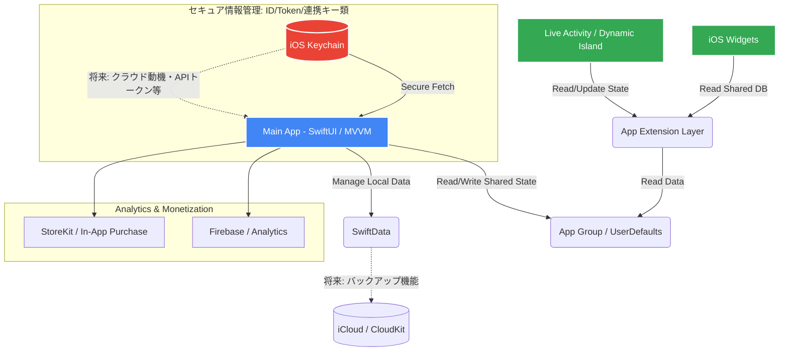

# No-Look-Budget: System Architecture

このドキュメントは「No-Look-Budget」アプリのシステム概要を定義します。

## アーキテクチャの解説
1. **Live Activity / Widget 中心の設計:** ユーザーがアプリアイコンをタップせずに情報を直感で取得・確認するための根幹部分。
2. **Security First (Keychain層):** 金銭やアカウント情報を扱うため、平文でのUserDefaults保存は避け、暗号化される領域である「Keychain」を中心に機密データを扱います。
3. **拡張性とマネタイズ:** 将来的にStoreKitによるサブスクリプション実装や、Firebaseを用いたユーザーアナリティクスなど、マーケターとして有用なツールを統合できる枠組みを持たせています。
