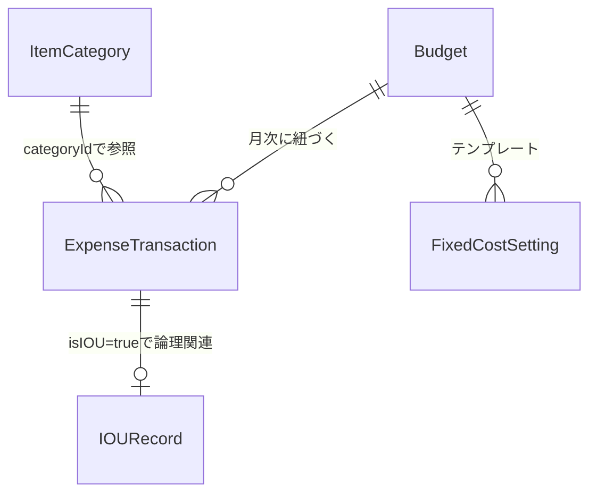

# No-Look-Budget 基本設計書

| 項目 | 内容 |
|------|------|
| ドキュメントID | BD-001 |
| バージョン | 2.0 |
| 最終更新日 | 2026-03-06 |
| 対応要件 | REQ-001 |

## 改版履歴

| バージョン | 日付 | 変更内容 | 変更者 |
|-----------|------|---------|--------|
| 1.0 | 2026-03-06 | 初版作成 | 開発チーム |
| 2.0 | 2026-03-06 | 画面-要件対応表・削除/更新時のIOU判定ロジック・データ初期値・状態遷移を追加 | 開発チーム |

---

## 1. システム構成

### 1.1 アーキテクチャパターン

**MVVM + Service Pattern** を採用。

```
┌──────────────────────────────────────────────────┐
│  View層                                          │
│  (SwiftUI Views / Widget)                        │
├──────────────────────────────────────────────────┤
│  ViewModel層                                     │
│  (ObservableObject / AppIntent)                  │
├──────────────────────────────────────────────────┤
│  Service層                                       │
│  (TransactionServiceProtocol)                    │
├──────────────────────────────────────────────────┤
│  Model層 (SwiftData @Model)                      │
│  Budget / ItemCategory / ExpenseTransaction /    │
│  IOURecord / FixedCostSetting                    │
├──────────────────────────────────────────────────┤
│  App Group (共有ストレージ)                       │
│  group.com.arima0903.NoLookBudget                │
└──────────────────────────────────────────────────┘
```

### 1.2 画面構成・要件対応

| 画面ID | 画面名 | 対応要件 | 概要 |
|--------|--------|---------|------|
| SCR-001 | ダッシュボード | FR-004 | メイン画面。円グラフ・カテゴリ一覧・直近履歴・推移グラフ |
| SCR-002 | 入力モーダル | FR-001,002,003 | 支出/収入/立替の金額入力（カスタム電卓キーパッド） |
| SCR-003 | 支出履歴 | FR-005 | 全支出の一覧・編集・削除 |
| SCR-004 | カテゴリ詳細 | FR-004 | カテゴリ別の支出詳細と円グラフ |
| SCR-005 | 立替管理 | FR-009 | 未回収/回収済みの立替一覧 |
| SCR-006 | 月次レビュー | FR-008 | 月末の振り返り・次月リセット |
| SCR-007 | 予算設定 | FR-007 | 手取り・固定費・先取り貯金の一元管理 |
| SCR-008 | カテゴリ設定 | FR-006 | カテゴリのCRUD・並び替え |
| SCR-009 | 設定 | - | サイドメニュー・各種設定リンク |
| SCR-010 | ウィジェット | FR-010 | ホーム画面ウィジェット（残高ゲージ） |

---

## 2. データ設計

### 2.1 エンティティ関連図



### 2.2 エンティティ定義

#### Budget（月次予算）

| プロパティ | 型 | 必須 | 初期値 | 説明 |
|------------|------|:----:|-------|------|
| id | UUID | ○ | UUID() | 主キー |
| month | Date | ○ | Date() | 対象月 |
| totalAmount | Double | ○ | 0 | 予算総額（手取り − 固定費 − 先取り貯金） |
| spentAmount | Double | ○ | 0 | 使用済み金額 |
| hasSetDebtRecovery | Bool | ○ | false | 借金繰越設定済みフラグ |
| incomeAmount | Double | | nil | 手取り額 |
| savingsAmount | Double | | nil | 先取り貯金額 |

**算出プロパティ**: `remainingAmount = totalAmount - spentAmount`

#### ItemCategory（支出カテゴリ）

| プロパティ | 型 | 必須 | 初期値 | 説明 |
|------------|------|:----:|-------|------|
| id | UUID | ○ | UUID() | 主キー |
| name | String | ○ | - | カテゴリ名 |
| totalAmount | Double | ○ | 0 | カテゴリ予算枠 |
| spentAmount | Double | ○ | 0 | カテゴリ支出額 |
| iconName | String | ○ | "circle" | SFSymbol名 |
| orderIndex | Int | ○ | 0 | 表示順 |

**算出プロパティ**: `remainingAmount = totalAmount - spentAmount`

#### ExpenseTransaction（取引履歴）

| プロパティ | 型 | 必須 | 初期値 | 説明 |
|------------|------|:----:|-------|------|
| id | UUID | ○ | UUID() | 主キー |
| date | Date | ○ | Date() | 記録日時 |
| amount | Double | ○ | - | 金額 |
| categoryId | UUID | | nil | 所属カテゴリ |
| isIOU | Bool | ○ | false | 立替フラグ |
| isIncome | Bool | ○ | false | 収入フラグ |
| isFixedCost | Bool | ○ | false | 固定費フラグ |
| title | String | | nil | 固定費等のタイトル |
| fixedCostSettingId | UUID | | nil | 固定費テンプレートID |

**フラグの排他関係**: `isIOU`, `isIncome`, `isFixedCost` は同時に true にならない

#### IOURecord（立替プール）

| プロパティ | 型 | 必須 | 初期値 | 説明 |
|------------|------|:----:|-------|------|
| id | UUID | ○ | UUID() | 主キー |
| date | Date | ○ | Date() | 立替日 |
| amount | Double | ○ | - | 立替金額 |
| title | String | ○ | "立替" | タイトル |
| isResolved | Bool | ○ | false | 回収済みフラグ |
| resolvedDate | Date | | nil | 回収日 |
| memo | String | | nil | メモ |

#### FixedCostSetting（固定費テンプレート）

| プロパティ | 型 | 必須 | 初期値 | 説明 |
|------------|------|:----:|-------|------|
| id | UUID | ○ | UUID() | 主キー |
| name | String | ○ | - | 固定費名称 |
| amount | Double | ○ | - | 金額 |
| orderIndex | Int | ○ | 0 | 表示順 |

---

## 3. 画面遷移設計

```
┌─────────────┐
│ ダッシュボード │ ← メイン画面
├─────────────┤
│ ┌───────┐   │    ┌──────────┐
│ │円グラフ├───┼───→│支出履歴    │→ タップ → 入力モーダル(編集)
│ └───────┘   │    └──────────┘
│ ┌───────┐   │    ┌──────────┐
│ │カテゴリ├───┼───→│カテゴリ詳細│
│ └───────┘   │    └──────────┘
│ ┌───────┐   │    ┌──────────┐
│ │記録ボタン├─┼───→│入力モーダル│ (sheet)
│ └───────┘   │    └──────────┘
└──────┬──────┘
       │ サイドメニュー
       ├→ 予算設定
       ├→ カテゴリ設定
       ├→ 立替管理
       ├→ 月次レビュー
       └→ 設定
```

---

## 4. 入力バリデーション設計

### 4.1 通常支出入力（FR-001）

| バリデーションID | ルール | エラー表現 | 根拠 |
|-----------------|--------|-----------|------|
| VLD-001 | 金額 > 0 であること | 確定ボタン無効化（=ボタン押下時にreturn falseで無反応） | 0円の支出は無意味なため |
| VLD-002 | カテゴリが選択されていること | 初期選択済みで担保 | UX上の不便を排除 |
| VLD-003 | 計算式が有効であること（末尾演算子不可、連続演算子不可） | 計算結果の非表示（nilでガード） | 不正な式によるクラッシュ防止 |

### 4.2 立替入力（FR-002）

| バリデーションID | ルール | エラー表現 | 根拠 |
|-----------------|--------|-----------|------|
| VLD-101 | 自分の支出欄が入力済みであること（初期値 "0" のままは未入力扱い） | Alert「自分の支出額を入力してください」 | 未入力防止。"0+0"は入力済みとみなす |
| VLD-102 | 立替総額 ≧ 自分の支出額 であること | Alert「立替総額が自分の支出額より小さくなっています」 | データ整合性の保証 |
| VLD-103 | 立替総額 > 0 であること | 確定ボタン無効化 | 0円の立替は無意味なため |

> [!IMPORTANT]
> VLD-101では「本当に自分の支出が0円」のケースに対応するため、`"0+0"` など式として入力された場合は入力済みとみなす。初期値 `"0"` と区別するための設計判断。

### 4.3 臨時収入入力（FR-003）

| バリデーションID | ルール | エラー表現 | 根拠 |
|-----------------|--------|-----------|------|
| VLD-201 | 金額 > 0 であること | 確定ボタン無効化 | 0円の収入は無意味なため |
| VLD-202 | 収入カテゴリが選択されていること | 初期選択済みで担保（デフォルト: 給与） | UX上の不便を排除 |

---

## 5. 予算計算ロジック

### 5.1 支出記録時の予算更新

| 操作 | isIOU | Budget.spentAmount | Category.spentAmount |
|------|:-----:|:------------------:|:--------------------:|
| 通常支出追加 | false | += amount | += amount |
| 立替追加 | true | 変化なし | 変化なし |

### 5.2 立替2段入力の計算ロジック

```
入力値:
  立替総額     = iouExpression の計算結果
  自分の支出額 = myExpenseExpression の計算結果

計算:
  実立替金 = 立替総額 − 自分の支出額

保存（2トランザクション）:
  if 実立替金 > 0:
    ExpenseTransaction(amount: 実立替金, isIOU: true)
    IOURecord(amount: 実立替金)
    → Budget / Category に影響なし
  if 自分の支出額 > 0:
    ExpenseTransaction(amount: 自分の支出額, isIOU: false)
    → Budget.spentAmount += 自分の支出額
    → Category.spentAmount += 自分の支出額
```

### 5.3 削除時の予算復元ロジック

| 削除対象 | Budget.totalAmount | Budget.spentAmount | Category.spentAmount |
|---------|:------------------:|:------------------:|:--------------------:|
| 通常支出 (isIOU=false, isIncome=false) | 変化なし | -= amount | -= amount |
| 立替 (isIOU=true) | 変化なし | **変化なし** | **変化なし** |
| 臨時収入 (isIncome=true) | -= amount | 変化なし | 変化なし |

> [!IMPORTANT]
> 立替（isIOU=true）の削除時は、追加時にBudget/Categoryに加算していないため、復元処理も行わない。

### 5.4 更新時の予算再計算

| パターン | 旧金額の復元 | 新金額の加算 |
|---------|:----------:|:----------:|
| 旧isIOU=false → 新isIOU=false | Budget -= oldAmount, Cat -= oldAmount | Budget += newAmount, Cat += newAmount |
| 旧isIOU=true → 新isIOU=true | 復元不要 | 加算不要 |
| 旧isIOU=false → 新isIOU=true | Budget -= oldAmount, Cat -= oldAmount | 加算不要 |
| 旧isIOU=true → 新isIOU=false | 復元不要 | Budget += newAmount, Cat += newAmount |

### 5.5 月跨ぎ処理

1. 前月の `overAmount = spentAmount - totalAmount`
2. `overAmount > 0` の場合、次月の `Budget.spentAmount = overAmount` として繰越
3. 次月の `Budget.totalAmount` はベース予算（現状固定値250,000円）

---

## 6. 入力モードの状態遷移

```
                 ┌──────────┐
                 │  支出モード │ （デフォルト）
                 └────┬─────┘
                      │
       ┌──────────────┼──────────────┐
       │              │              │
 ┌─────▼─────┐  ┌─────▼─────┐  ┌────▼──────┐
 │ 通常支出    │  │ 立替モード  │  │ 臨時収入   │
 │            │  │ (isIOUMode)│  │ (income)  │
 │ 1段入力    │  │ 2段入力    │  │ 1段入力   │
 │ 緑ボタン   │  │ 橙ボタン   │  │ 緑ボタン  │
 └────────────┘  └────────────┘  └───────────┘
```

---

## 7. 外部I/F設計

### 7.1 App Group（アプリ ⇔ ウィジェット）

| 方向 | データ | 方法 |
|------|--------|------|
| アプリ → ウィジェット | 予算・支出データ | SwiftData共有コンテナ |
| ウィジェット → アプリ | 支出登録リクエスト | AppIntent |

### 7.2 WidgetKit

- `WidgetCenter.shared.reloadAllTimelines()` でデータ変更時にウィジェットを更新
- App Group ID: `group.com.arima0903.NoLookBudget`
