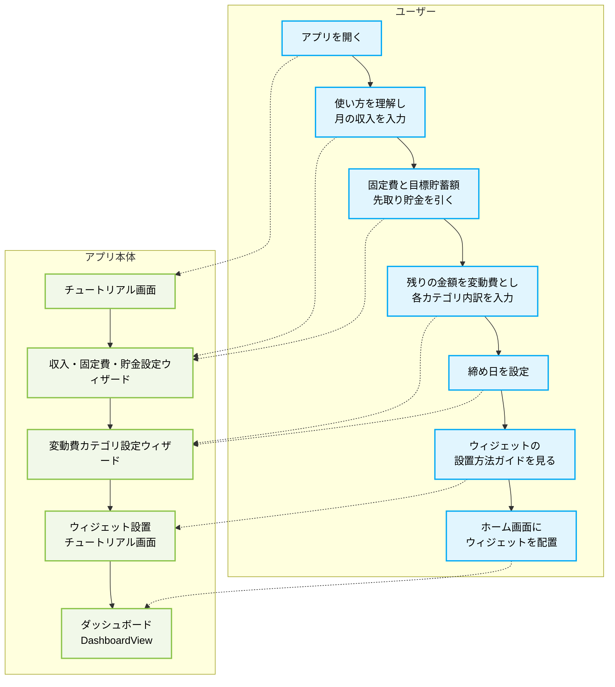
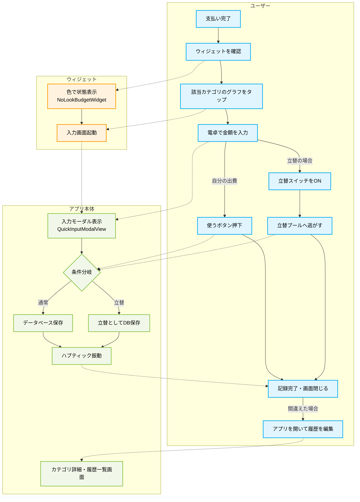
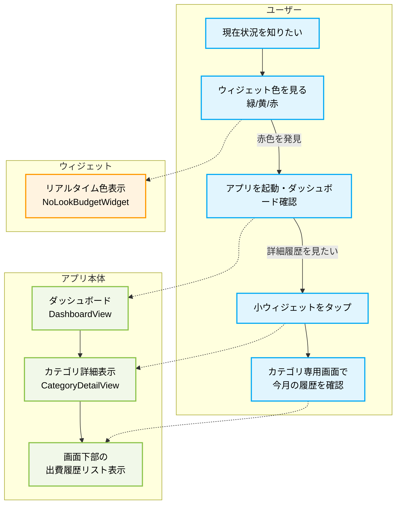
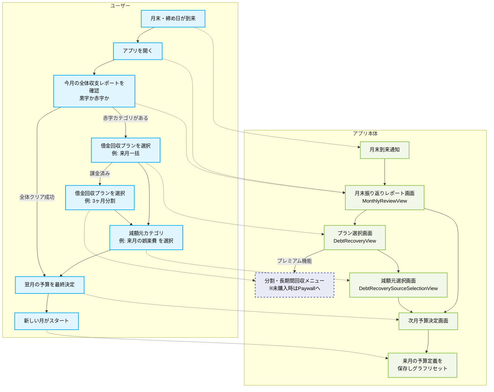
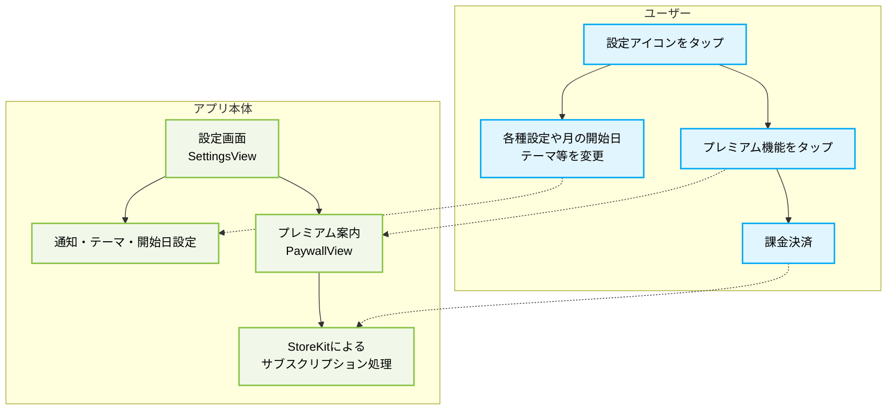

# Orbit Budget: ユーザー利用フロー (検証済・最新版)

「ADHD層・めんどくさがり層」に特化したUX設計から、無駄な機能（Undoや当月間の予算振替）を削ぎ落とし、全体予算内でやりくりする「月末の振り返りと目標設定」を最重要イベントとして定義したフローです。

---

## 1. 導入 (Onboarding)
単なる初期設定だけでなく、最大の価値である「ウィジェットの設置」までを完了させるフロー。
また、浪費家が確実にお金を残せるよう、「固定費と先取り貯金」を真っ先に天引きし、残った額を「変動費（アプリで管理する予算）」として定義する仕組みを取り入れます。

* **必要な画面:** スプラッシュ・チュートリアル画面、**固定費・貯蓄設定画面（Income & Fixed Cost Setup）**、**変動費カテゴリ設定画面**、ウィジェット設置手順ガイド画面

---

## 2. 記録 (Logging) - 日常の出費入力
支出が発生した際に行う、極限まで摩擦を減らしたアクション。間違えた場合は詳細画面から訂正する（Undoボタンで隠さない）。

* **必要な画面:** ホームウィジェット、`QuickInputModalView`、**取引履歴一覧・編集画面（後から直す用）**

---

## 3. 確認 (Monitoring) - 現在状況の把握
色による直感的な把握と、原因深掘り（何に使いすぎたか）のアクション。

* **必要な画面:** `DashboardView`、`CategoryDetailView`（下半分の履歴リスト）

---

## 4. 月末の振り返りと翌月目標 (Review & Adjusting) 【重要】
「全体予算をクリアできたか（成功）」の確認と、月を跨いだ時の借金ペナルティ（翌月補填）を決める一大イベント。

* **必要な画面:** **月末振り返りレポート画面（MonthlyReviewView）**、`DebtRecoveryView`、`DebtRecoverySourceSelectionView`、**次月予算決定・確認画面**

---

## 5. 管理・設定 (Management & App Settings)
アプリ全体の環境設定や有償機能のアンロックに関するアクション。

* **必要な画面:** 設定（Settings）画面、プレミアム案内（Paywall）画面
